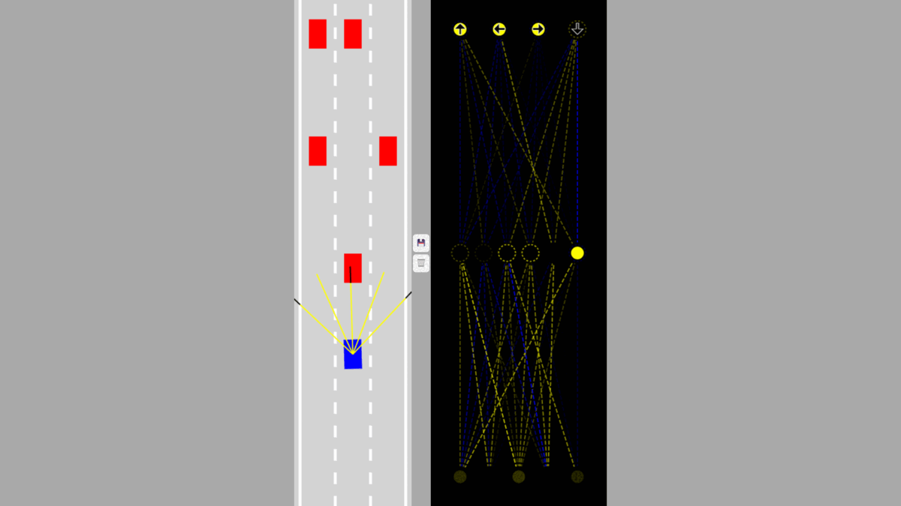

# Self Driving Car 🚗 App

Welcome to the Self Driving Car App! This app is a simulation of a self driving car using artificial intelligence (AI), neural networks, and machine learning.

## Tech Stack

This app was built using the following technologies:

- JavaScript
- HTML
- CSS

## Features

- Simulation of a self driving car navigating a virtual roadway
- Utilization of AI, neural networks, and machine learning to make driving decisions

## Installation

To get started, clone the repository to your local machine and open the index.html file in your browser.

```
git clone https://github.com/AnmolVerma404/Self-Driving-Car.git
cd <floder-name>
open index.html
```

## About AI

AI, or artificial intelligence, refers to the ability of a computer or machine to perform tasks that would normally require human intelligence, such as learning and problem solving. In this app, we are using AI to make driving decisions for the self driving car.

## About Neural Networks

A neural network is a type of machine learning algorithm modeled after the structure and function of the human brain. It is composed of layers of interconnected "neurons," which process and transmit information. In this app, we are using a neural network to process data and make driving decisions for the self driving car.

## About Machine Learning

Machine learning is a type of artificial intelligence that involves training algorithms on data to allow them to make decisions or predictions. In this app, we are using machine learning to train the driving algorithm for the self driving car.

## What it look's like



## Contributing

If you would like to contribute to the project, please follow these guidelines:

1. Fork the repository.
2. Create a branch for your changes (e.g. add-new-feature).
3. Commit your changes with a clear and descriptive message.
4. Open a pull request.
5. We welcome any contributions, big or small. Thank you for considering helping out!
